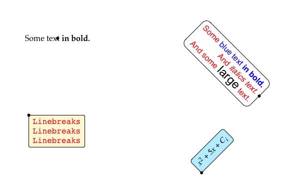
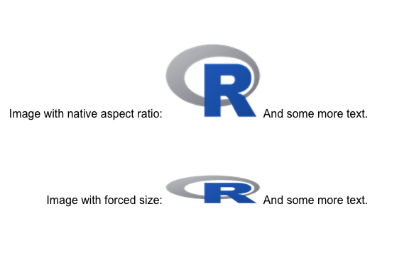
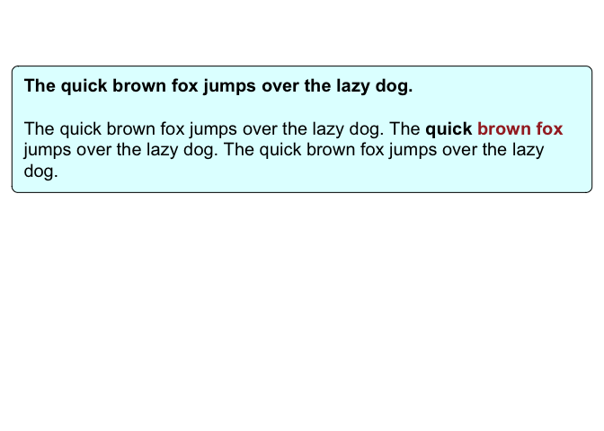

<!-- README.md is generated from README.Rmd. Please edit that file -->

# gridtext

[](https://cran.r-project.org/package=gridtext)
[](https://travis-ci.org/wilkelab/gridtext)
[](https://codecov.io/github/wilkelab/gridtext?branch=master)

Improved text rendering support for grid graphics in R, written by Claus
O. Wilke

This is an experiment. The API is not stable. Please do not use this in
any context where you need your code to work. No user support will be
provided.

## Installation

``` r
devtools::install_github("clauswilke/gridtext")
```

## Examples

### Labels grob

The function `labels_grob()` serves as a replacement for `textGrob()`.
It is vectorized and can draw multiple labels with one call. Labels can
be drawn with padding, margins, and at arbitrary angles. Graphical
parameters are provided as a data frame/tibble for simplicity and
efficiency.

``` r
library(grid)
library(gridtext)
library(tibble)

label_data <- tibble(
  label = c("Descenders: pgqjy", "This is a label\nwith two lines", "Hello!"),
  x = unit(c(.3, .8, .5), "npc"),
  y = unit(c(.9, .5, .3), "npc"),
  hjust = 0,
  vjust = 0.5,
  hjust_int = 1, # internal hjust, vjust, defines how text label
  vjust_int = 1, # is positioned inside the box
  angle = c(0, 45, -45),
  color = "blue",
  fill = "azure1",
  fontsize = 10,
  fontfamily = "Comic Sans MS",
  padding = list(mar(5, 5, 3, 5)),
  margin = list(mar(5, 5, 5, 5))
)

grid.newpage()
g <- labels_grob(label_data)
grid.draw(g)
```

<!-- -->

Also, the boxes enclosing the labels can be all made the same size by
setting `align_frame_widths` and/or `align_frame_heights` to `TRUE`.
This may be useful when using this grob to provide labels for an x or y
axis:

``` r
label_data <- tibble(
  label = c("This", "is", "an", "example", "rotated", "x axis"),
  x = unit(.15*1:6, "npc"),
  y = unit(0.8, "npc"),
  hjust = 1,
  vjust = 0.5,
  hjust_int = 0.5,
  vjust_int = 1,
  angle = 45,
  fontsize = 10, fontfamily = "Comic Sans MS",
  padding = list(mar(5, 5, 3, 5)),
  margin = list(mar(5, 5, 5, 5))
)
grid.newpage()
g <- labels_grob(label_data, align_frame_widths = TRUE, debug = TRUE)
grid.draw(g)
```

<!-- -->

(The setting `debug = TRUE` shows the margin, padding, and the reference
point used for rotation.)

The same example without aligned frames:

``` r
grid.newpage()
g <- labels_grob(label_data, debug = TRUE)
grid.draw(g)
```

<!-- -->

### Rich-text grob

The function `rich_text_grob()` can be used to draw simple html-like
text. It is currently not vectorized, but the ultimate goal is to write
a variant of `labels_grob()` that can make use of it.

``` r
library(grid)
library(gridtext)
text1 <- "<span style='font-family:\"Comic Sans MS\"; font-size:20; color:orange'>Comic Sans! Yay!</span>"
text2 <- "Some <span style='color:red'>red</span> text <b>in bold.</b><br>And <i>more</i> text.<br>And some <span style='font-size:18'>large</span> text."
text3 <- "5<i>x</i><sup>2</sup><span style='color:blue'> + 7<i>x</i></span> - <i>α<sub>i</sub></i>"

grid.newpage()
grid.draw(rich_text_grob(text1, x = 0., y = 1, hjust = 0, vjust = 1))
grid.draw(rich_text_grob(text2, hjust_int = 0, x = 0.3, y = 0.5, angle = 45))
# set `debug = TRUE` to understand how the grob is placed
grid.draw(rich_text_grob(text2, hjust_int = 1, x = 0.8, y = 0.7, angle = -90, debug = TRUE))
grid.draw(rich_text_grob(text3, x = 0.1, y = 0.05, hjust = 0, vjust = 0, padding = mar(5, 5, 5, 5), debug = TRUE))
```

<!-- -->

Basic markdown is also supplorted via `markdown_grob()`, which is a
variant of `rich_text_grob()` taking markdown instead of html.

``` r
grid.draw(
  markdown_grob(
    "Resistance of **Amoxicillin** in *E. coli*",
    padding = mar(5, 10, 5, 10),
    debug = TRUE
  )
)
```

<!-- -->
